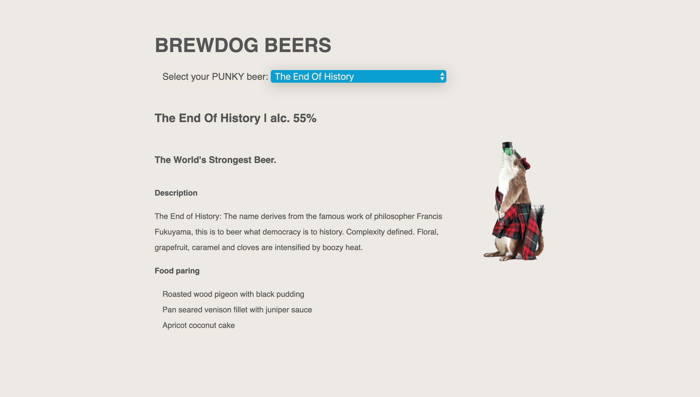

# PunkIpa 



This is a front-end web app that uses <https://api.punkapi.com/v2/> to dispaly different beers requested. This app was built with JavaScript and PubSub pattern making API requests to load JSON data into my application. 

## MVP

* The application should display data from an API request.
* The application should have a clear separation of concerns using a model and views.

## Extensions

* Take input from the user to update the page. You could update the page by filtering or manipulating the data on user interaction, or you might make further API requests to load more data that is then displayed.

## Advanced Extensions

* Looking into a library to visual the data.

Leaflet is an open-source library for rendering maps
HighCharts is an open-source library for rendering charts
You will need to use the library's documentation to integrate it into your application.

## Considerations

To make the request you may use either ```fetch``` or the ```XMLHttpRequest``` object.
